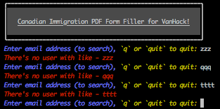
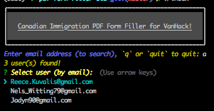
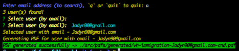

# Automatic Immigration PDF Form Filler (for VH)

This project creates a PDF file by automatically filling out the template PDF file, with some user data. _**Note: the data is not real data. In a real application the data will/should be gotten from a data store.**_ See usage below

## Requirements

- [NodeJS 8+](https://nodejs.org/en/)
- [PDFtk](https://www.pdflabs.com/tools/pdftk-the-pdf-toolkit/)
- [NPM](https://www.npmjs.com/)

## Installation

- Clone the project - `git clone https://github.com/elchroy/pdf-form-filler.git`
- Enter into the project's director - `cd pdf-form-filler`
- Install dependencies - `npm install`

## Usage

This is a Command Line Application.

1. From the command-line/terminal, run `./index` and follow the prompt:
2. Enter any part of the the email address of the desired user. You don't have to know the exact, just a part of it should suffice.

3. You can also enter `q` or `quit` to exit.

4. If there is no user with a matching email, a message is displayed - `There's no user with like - zzz`. Go back to step 2.

5. Otherwise, a list (and number) of users with matching emails is presented.
6. Select a matching email, using `UP/DOWN` arrows and press `ENTER`.

7. The PDF file gets generated and the link is displayed on the console. You can also open the `./src/pdfs/generated/` directory, where the PDF is saved.

8. You can also press `control+C` anytime to quit.

## Assumptions

This project works under the following assumptions:

- The dummy data is correct and matches the fields in the PDF document.
- The PDF is question is the Canadian Immigration PDF form, currently being used by VanHack.
- Each user has a unique email\*

## Testing

- @TODO

## License

- [MIT](http://opensource.org/licenses/MIT)
